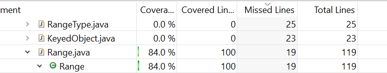

**SENG 438 - Software Testing, Reliability, and Quality**

**Lab. Report #3 – Code Coverage, Adequacy Criteria and Test Case Correlation**

| Group \#:       |     |
| --------------- | --- |
| Student Names:  |     |
| Chun-chun Huang |     |
| Amneet Deol     |     |
| Shreosi Debnath |     |
| Hiten Mahal     |     |

(Note that some labs require individual reports while others require one report
for each group. Please see each lab document for details.)

# 1 Introduction

Text…

# 2 Manual data-flow coverage calculations for X and Y methods

DataUtilities.calculateColumnTotal

- Data Flow Graph

## Def-use sets

| Line | use            | def      |
| ---- | -------------- | -------- |
| 1    | data           |          |
| 2    |                | total    |
| 3    | data           | rowCount |
| 4    | r, rowCount    | r        |
| 5    | r,column,data  | n        |
| 6    | n              |          |
| 7    | total,n        |          |
| 10   | r2,rowCount    | r2       |
| 11   | r2,column,data | n        |
| 12   | n              |          |
| 13   | total,n        |          |
| 16   | total          |          |

## DU-pairs

| var      | D-U pair        |
| -------- | --------------- |
| total    | (2,7)           |
| rowCount | (3,4)           |
| r        | (4,4),(4,5)     |
| n        | (5,6),(11,12)   |
| r2       | (10,10),(10,11) |

- DU-pair coverage

Range.getUpperBound

- Data Flow Graph -- the CFG in this case

- Def-use sets

| Line | use            | def      |
| ---- | -------------- | -------- |
| 1    | lower, upper   |          |
| 2    | msg, lower     | msg      |
| 3    | upper          |          |
| 4    | msg            |          |

- DU-pairs: 
There are actually no DU pairs because it always executes the same path (regardless of the upper, lower values). 

- DU-pair coverage: 
There are no decisions that need to be made in this method (or conditions) so there are actually no alternative paths so no coverage considerations (it will always execute/follow the same path). We probably should have chosen a different method for this in hindsight.

# 3 A detailed description of the testing strategy for the new unit test

We ran the coverage tool EclEmma for our unit tests from assignment 2. Looking at the metrics for statement coverage, we implemented tests trying to reach 90% statement coverage. As we approached 90% line coverage, our brach coverage also reached 70%.

# 4 A high level description of five selected test cases you have designed using coverage information, and how they have increased code coverage

## DataUtilitiesTest

Test Case 1: cloneTest()
clone() is a new method in DataUtilities that was not present in assignment 2, and so we had 0% coverage for this function. We created cloneTest() and cloneTestWithNull() to provide coverage over this new method and with these new tests were able to provide 100% instruction, branch, and method coverage on the clone() method.

Test Case 2: calculateRowTotalWithNegativeColCount()
calculateRowTotal() is a method in DataUtilities that we had 83% coverage for from Assignment 2. There was one pathway that we were not testing which was when a Values2D with a negative column count is passed in, 0 should be returned. We created a new test calculateRowTotalWithNegativeColCount() to test this functionality and were able to achieve 100% instruction, branch, and method coverage on the calculateRowTotal() method.

## RangeTest

Test Case 3: testCombine_Range1ParamIsNull(),testCombine_Range2ParamIsNull()

combine(range1: Range,range2 Range) is a method that we had around 50% line coverage and 30% brach coverage in our assignment 2. It will in fact return one of the range if the other range is null, so we increased the line coverage to 100% and branch cover to 100% by setting one of the parameter to null in both test methods.

Test Case 4: testScale_FactorSmallerThanZero_ThrowIllegalArgumentException()

scale(range:Range,factor:double) is the method we did not cover in assignment 2. By entering the expected argument, we can only reach 50% line and branch coverage. In this test cases, we entered a factor which is smaller than 0, so the method will throw an exception. This allowed us to reach 100% line and branch coverage

Test Case 5: testShift_shiftExampleRangeBy5AllowingZeroCrossing()

shift(base:Range,delta:double,allowZeroCrossing:boolean) is the base of the other shift method in the Range class. Other shift method calls this method with allowZeroCrossing set to false, so the branch coverage would be 50% and the line coverage would be about 60%. We used this test method to call shift setting allowZeroCrossing to true, so it has branch and statement completely covered by our test cases.

# 5 A detailed report of the coverage achieved of each class and method (a screen shot from the code cover results in green and red color would suffice)

---

**DataUtilities Before New Tests**

Instruction Coverage

Branch Coverage

Method Coverage

---

**DataUtilities After New Tests**

Instruction Coverage

Branch Coverage

Method Coverage

---

## Range.java

### Range statement coverage

### Range brach coverage

# 6 Pros and Cons of coverage tools used and Metrics you report

## Pros of EclEmma

- Easy installation through the Eclipse extention market
- Allows code measurement with a variety of coverage metrics (line coverage, branch coverage, etc)
- EclEmma highlights the code that has been covered during the testing which allows for ease-of-use

## Cons of EclEmma

- It only measures coverage during testing but it does not give insight to the quality or performance of the code

# 7 A comparison on the advantages and disadvantages of requirements-based test generation and coverage-based test generation.

Text…

# 8 A discussion on how the team work/effort was divided and managed

As this lab assignment fell over reading week, 2 members worked on the manual data-flow coverage calculations and graph during the lab session. The test-writing was then split between members of the group in preparation for the demo. We checked each other's work for the tests and helped to increase the coverage and also collaborated on finishing the report. 

# 9 Any difficulties encountered, challenges overcome, and lessons learned from performing the lab

A couple of members in the group had initial issues setting up the system from assignment 2, especially with the package locations, but once that was figured out, it was not too complicated. We did also have issues reaching the 90% statement coverage due to the unreachable sections of code, but achieved 89.9% in the end. We all learned a lot about the coverage tools as well and realized how impactful unreachable code can be on your coverage. 

# 10 Comments/feedback on the lab itself

We enjoyed working on the lab and building off of the tests written in assignment 2. It was especially interesting to see the initial coverage that we had from assignment 2 and how much we could improve through the added coverage testing. It really helped to better conceptualize how much effort goes into comprehensive testing as a whole. 
